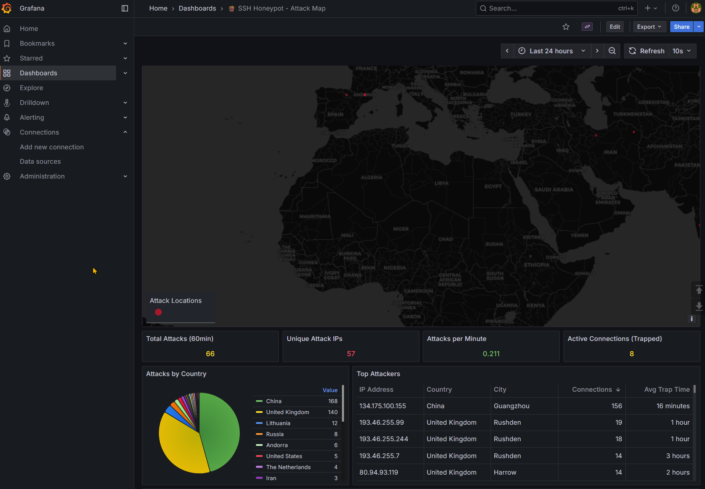
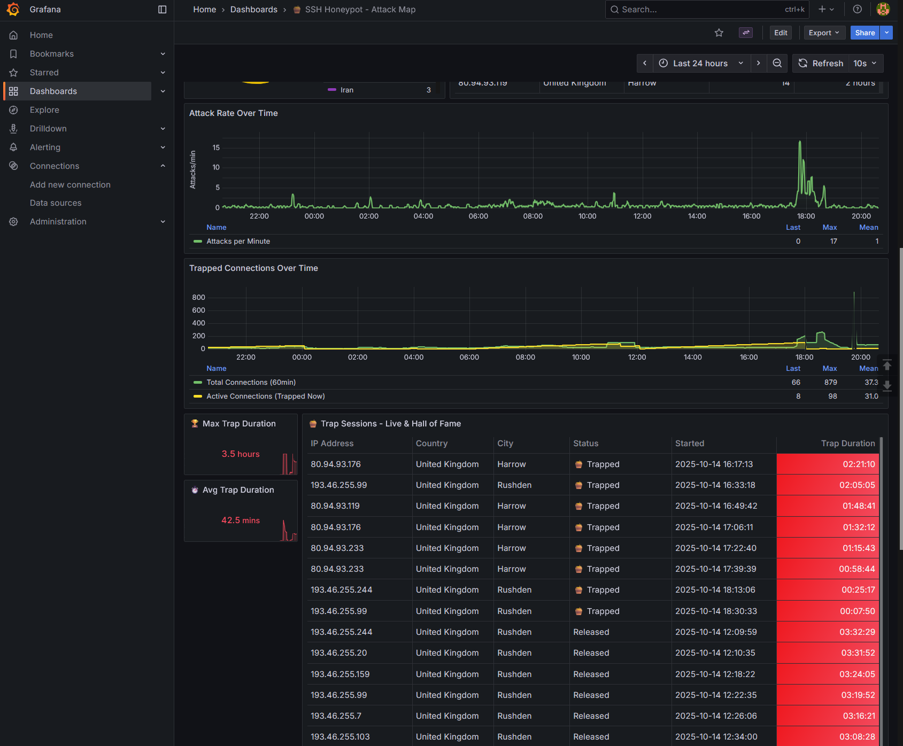

# 🍯 SSH Honeypot Dashboard for Grafana

A comprehensive Grafana dashboard for monitoring SSH honeypot attacks using Endlessh, featuring a persistent "Hall of Fame" for the longest trap sessions.





## Features

- 🏆 **Hall of Fame System** - Persistent Top 100 all-time longest trap sessions
- 🗺️ **Attack Map** - Geographic visualization of attack origins
- 📊 **Real-time Metrics** - Active connections, attack rate, trap duration statistics
- 🎯 **Smart Deduplication** - Only the longest session per IP address
- 💾 **Persistent Storage** - Hall of Fame survives container restarts
- 🌍 **GeoIP Integration** - Automatic location lookup for attacker IPs
- ⚡ **Performance Optimized** - 6-hour log window with persistent historical data

## What is This?

This dashboard monitors an [Endlessh](https://github.com/skeeto/endlessh) SSH honeypot - a tarpit that traps SSH clients by slowly sending an endless SSH banner. The longer an attacker stays connected, the higher their "score"!

### Dashboard Panels

1. **Attack Map** - World map showing attack origins sized by connection count
2. **Statistics** - Total attacks, unique IPs, attacks per minute, active connections
3. **Max/Avg Trap Duration** - How long attackers stay trapped
4. **Trap Sessions - Live & Hall of Fame** - Detailed table showing:
   - Currently trapped connections (live updates)
   - Top 100 longest trap sessions of all time
   - IP address, country, city, status, start time, duration

## Prerequisites

- Endlessh SSH honeypot running as systemd service
- Prometheus
- Grafana
- Python 3.11+
- Docker (recommended) or systemd for the exporter

## Installation

### 1. Set up Endlessh

Install and configure Endlessh SSH honeypot:

```bash
# Install endlessh
sudo apt install endlessh

# Configure it to run on port 22 (or any port)
sudo systemctl enable endlessh
sudo systemctl start endlessh
```

### 2. Deploy the Custom Exporter

The dashboard requires a custom Prometheus exporter that parses Endlessh logs and provides GeoIP enrichment.

#### Option A: Docker (Recommended)

Create `docker-compose.yml`:

```yaml
services:
  endlessh-exporter:
    build:
      context: .
      dockerfile: Dockerfile
    container_name: endlessh-exporter
    restart: unless-stopped
    volumes:
      - /var/log/journal:/var/log/journal:ro
      - /run/systemd:/run/systemd:ro
      - /etc/machine-id:/etc/machine-id:ro
      - ./data:/data  # Persistent Hall of Fame storage
    ports:
      - "9314:9314"
    privileged: true
```

Create `Dockerfile`:

```dockerfile
FROM python:3.11-slim

RUN apt-get update && apt-get install -y systemd && rm -rf /var/lib/apt/lists/*

WORKDIR /app

COPY endlessh-exporter-geoip.py /app/

CMD ["python3", "endlessh-exporter-geoip.py"]
```

Copy `endlessh-exporter-geoip.py` to the same directory and run:

```bash
docker-compose up -d
```

#### Option B: Systemd Service

1. Copy `endlessh-exporter-geoip.py` to `/usr/local/bin/`
2. Create `/etc/systemd/system/endlessh-exporter.service`:

```ini
[Unit]
Description=Endlessh Prometheus Exporter with GeoIP
After=network.target

[Service]
Type=simple
User=root
ExecStart=/usr/bin/python3 /usr/local/bin/endlessh-exporter-geoip.py
Restart=always
RestartSec=10

[Install]
WantedBy=multi-user.target
```

3. Enable and start:

```bash
sudo systemctl daemon-reload
sudo systemctl enable endlessh-exporter
sudo systemctl start endlessh-exporter
```

The exporter will be available at `http://localhost:9314/metrics`

### 3. Configure Prometheus

Add the exporter to your `prometheus.yml`:

```yaml
scrape_configs:
  - job_name: 'endlessh'
    static_configs:
      - targets: ['localhost:9314']
```

Reload Prometheus:
```bash
sudo systemctl reload prometheus
```

### 4. Import the Dashboard

#### Option A: Import from File

1. Open Grafana
2. Go to **Dashboards** → **Import**
3. Upload `honeypot.json` or paste its content
4. Select your Prometheus datasource
5. Click **Import**

#### Option B: Import from Grafana.com (Coming Soon)

For Grafana.com imports, use `honeypot-for-grafana-com.json` which includes proper datasource templating:

1. Open Grafana
2. Go to **Dashboards** → **Import**
3. Upload `honeypot-for-grafana-com.json`
4. Map the Prometheus datasource when prompted
5. Click **Import**

The Grafana.com version uses `${DS_PROMETHEUS}` templating for easier datasource mapping.

## How It Works

### The Exporter

The custom Python exporter (`endlessh-exporter-geoip.py`):

1. **Parses journald logs** from Endlessh (last 6 hours)
2. **Tracks connections** by IP:port (unique identifier)
3. **Enriches with GeoIP** data using ip-api.com
4. **Calculates metrics**:
   - Active (trapped) connections
   - Connection durations
   - Geographic distribution
5. **Maintains Hall of Fame**:
   - Top 100 longest trap sessions
   - Deduplicated per IP (only longest session kept)
   - Persisted to `/data/hall_of_fame.json`
   - Survives container restarts

### The Hall of Fame Logic

```python
# Current trapped connections: Always shown
trapped_connections = [all currently trapped]

# Released connections: Only Top 100 by duration
hall_of_fame = load_from_json()  # Loads on startup
hall_of_fame.update(new_released_connections)
hall_of_fame = deduplicate_by_ip(hall_of_fame)  # Keep longest per IP
hall_of_fame = keep_top_100(hall_of_fame)
save_to_json(hall_of_fame)  # Persists after each update

# Display = trapped + hall_of_fame
```

### Metrics Provided

- `endlessh_connection_info` - Individual connection details (with labels: ip, port, country, city, status, started, sort_order, ip_group)
- `endlessh_total_connections` - Total connections in last 6 hours
- `endlessh_active_connections` - Currently trapped connections
- `endlessh_max_trap_duration_seconds` - Longest trap session
- `endlessh_avg_trap_duration_seconds` - Average trap duration
- `endlessh_unique_ips` - Number of unique attacker IPs
- `endlessh_connections_per_ip` - Connections per IP with GeoIP data
- `endlessh_connections_per_country` - Attacks by country

## Configuration

### Adjusting Log Window

By default, the exporter parses the last 6 hours of logs. To change this, edit `endlessh-exporter-geoip.py`:

```python
# Change this line (line ~69):
cmd_6h = ['journalctl', '-u', 'endlessh', '--since', '6 hours ago', '--no-pager']

# To e.g. 12 hours:
cmd_12h = ['journalctl', '-u', 'endlessh', '--since', '12 hours ago', '--no-pager']
```

### Changing Hall of Fame Size

To keep more or fewer records, edit line ~238:

```python
if len(hall_of_fame) > 100:  # Change 100 to your desired size
```

### GeoIP Rate Limiting

The exporter uses ip-api.com (free tier: 45 requests/minute). Results are cached. If you have many unique IPs, consider:

1. Using a paid API key
2. Running a local GeoIP database (MaxMind GeoLite2)
3. Increasing cache duration

## Troubleshooting

### No data showing up

1. Check if Endlessh is running: `sudo systemctl status endlessh`
2. Check if exporter is running: `curl http://localhost:9314/metrics`
3. Check Prometheus targets: Grafana → Prometheus datasource → Status
4. Check exporter logs: `docker logs endlessh-exporter` or `journalctl -u endlessh-exporter -f`

### Hall of Fame not persisting

1. Check if `/data` volume is mounted correctly
2. Check file permissions: `ls -la /path/to/data/hall_of_fame.json`
3. Check exporter logs for save/load errors

### GeoIP lookups failing

1. Check internet connectivity from container/service
2. Verify ip-api.com is not blocked by firewall
3. Consider implementing local GeoIP database

## Performance Notes

- **Log Window**: 6 hours is optimized for quick parsing. Longer windows increase scrape time.
- **Hall of Fame**: Capped at 100 entries to keep dashboard responsive. Increase if needed.
- **Scrape Interval**: Default Prometheus scrape is 15s. Can be increased to 30s or 60s.

## Dashboard Customization

### Changing Colors

The "Trap Duration" column uses color thresholds:
- Green: < 60 seconds
- Yellow: 60-180 seconds
- Orange: 180-300 seconds
- Red: > 300 seconds

Edit these in the dashboard's field overrides.

### Table Sorting

The table is sorted by:
1. Status (Trapped first)
2. Trap Duration (longest first)

This is done via a hidden `sort_order` field calculated by the exporter.

## Credits

- Dashboard created for Endlessh honeypot monitoring
- GeoIP data provided by [ip-api.com](http://ip-api.com)
- Inspired by the need to track persistent attackers

## License

MIT License - Feel free to use and modify!

## Contributing

Found a bug or have an improvement? Open an issue or PR on GitHub!

## Support

If you find this dashboard useful, consider:
- ⭐ Starring the repository
- 🐛 Reporting issues
- 💡 Suggesting features
- 📝 Improving documentation

---

**Note**: This is a monitoring tool for security research and educational purposes. Always ensure your honeypot is properly isolated and does not pose a security risk to your network.
